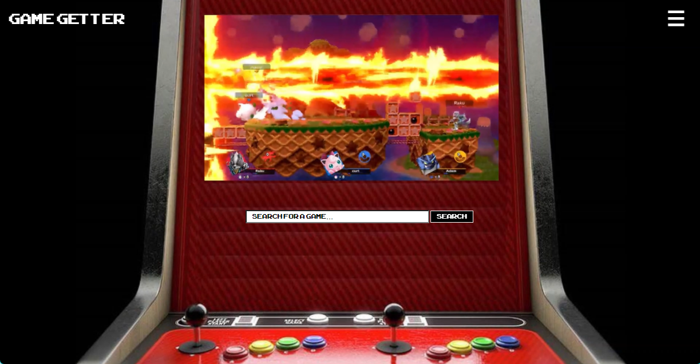
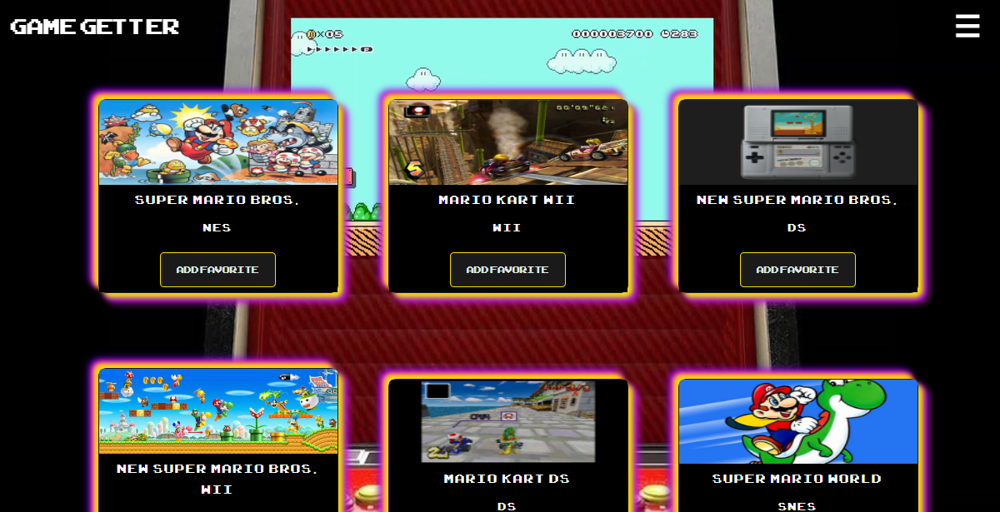
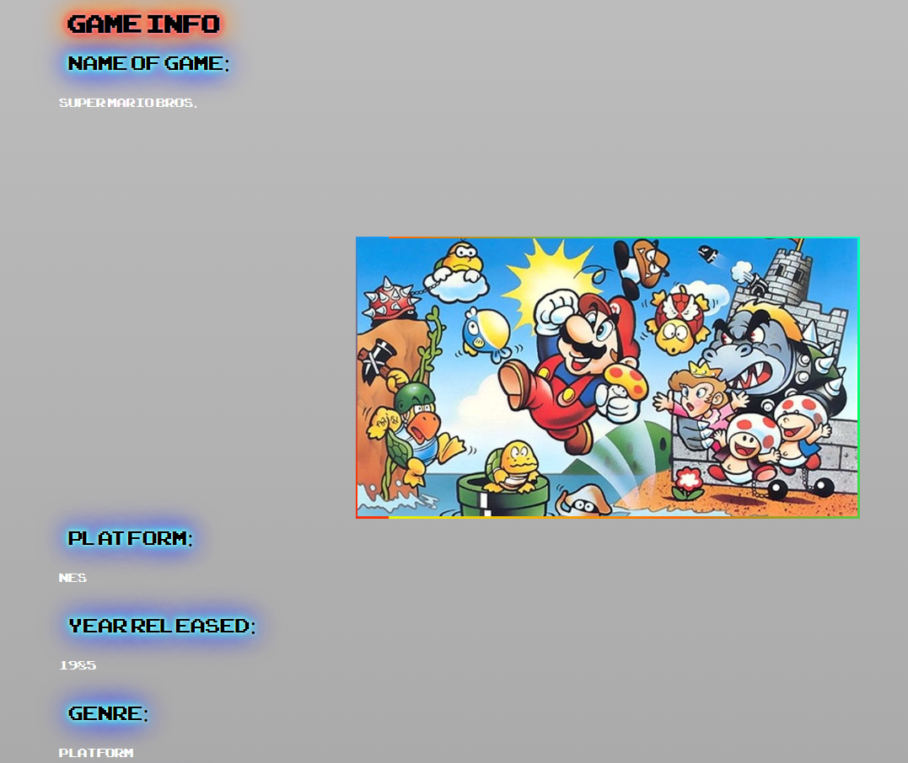
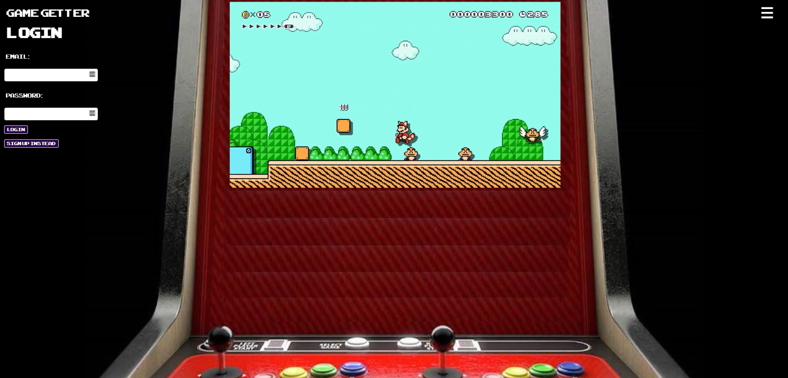
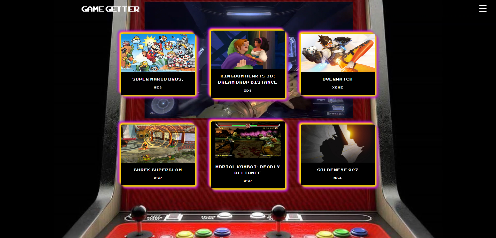
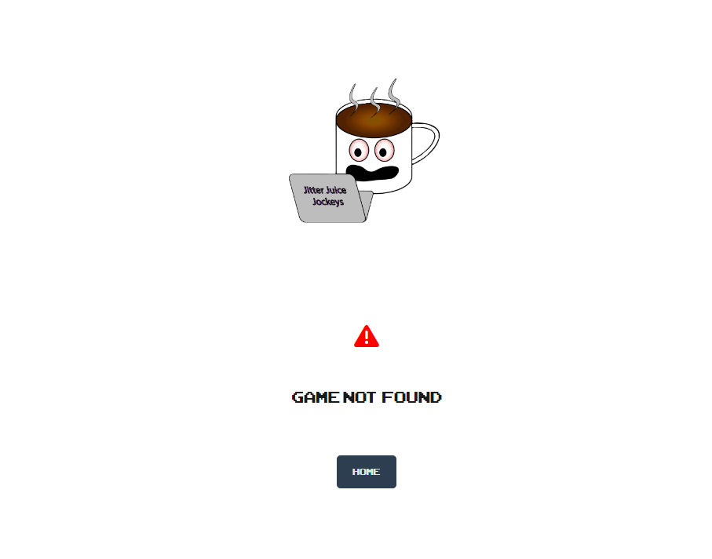

# Game Getter
  [Link to the Game Getter Website!](https://game-getter-project-2.herokuapp.com/)
  ## Table Of Contents
  + [Description](#description)
  + [Installation Instructions](#installation-instructions)
  + [Usage Information](#usage-information)
  + [Pictures](#pictures)
  + [Test Instructions](#test-instructions)
  + [Contribution Guidelines](#contribution-guidelines)
  + [Questions](#questions)
  ## Description
  Game Getter is an interactive application that allows users to search for over 16,700 video games from various genres, publishers, release years and more! After searching, a display of all related search results will be curated just for you. When clicking on a search result, users may receive information pertaining to the game such as: available platforms to play on, the year of release, a brief description of the game, the publisher, global sales, critic scores, the developer, the ESRB rating, an image associated with the game, and a website for more information on about the game if it exists. If users would like to save any search result to their own personalized dashboard for referencing later, they will be prompted to sign up or log in.

  ## Installation Instructions
  Simply click on the [link](https://game-getter-project-2.herokuapp.com/) to the deployed application.
  
  ## Usage Information
  Users without an account may access the game getter search bar feature that displays a dashboard of games related to your input. Clicking on a game card with bring up a display with descriptive information pertaining to the game. You may notice that the game card results have an "Add Favorite" button. In order to obtain this feature, users must create an account or log in to add this game to their personalized dashboard. 

  ---

  ## Pictures
  
  
  
  
  
  
  ## Test Instructions
  Feel free to use this tester account's credentials to browse the application responsibly. 

  Username: tester

  Email: test@test.com

  Password: password
  ## Contribution Guidelines
  We are not accepting contributions at this time. 
  
  ## Questions
  If you have any questions, feel free to reach out to the following development team members:

  Tyler Evans, Database Management and UI Design

  GitHub: https://github.com/TDEvans97   Email: tylerdevansmusic@gmail.com

